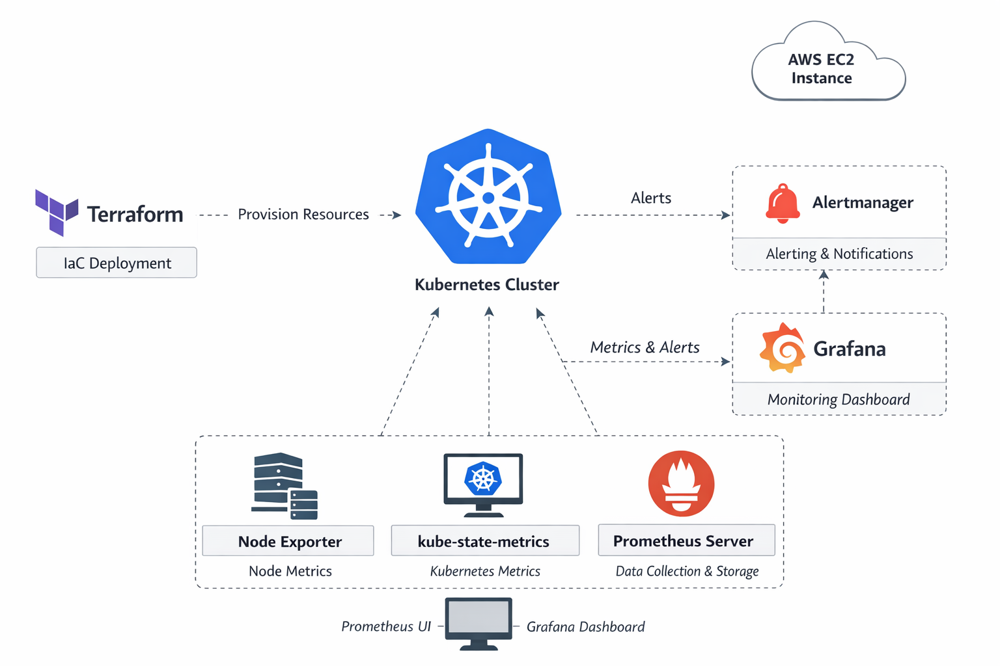
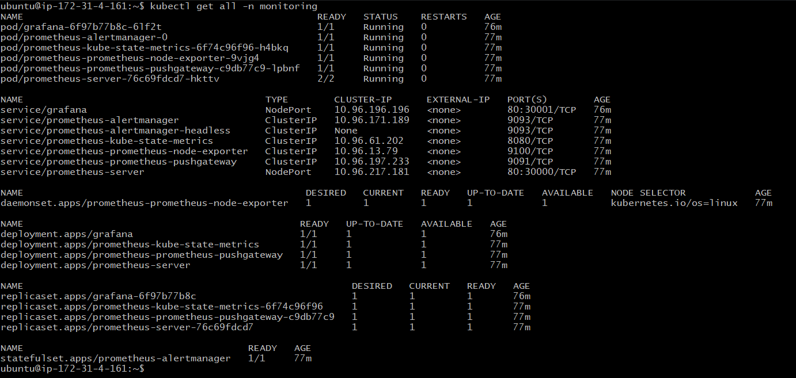
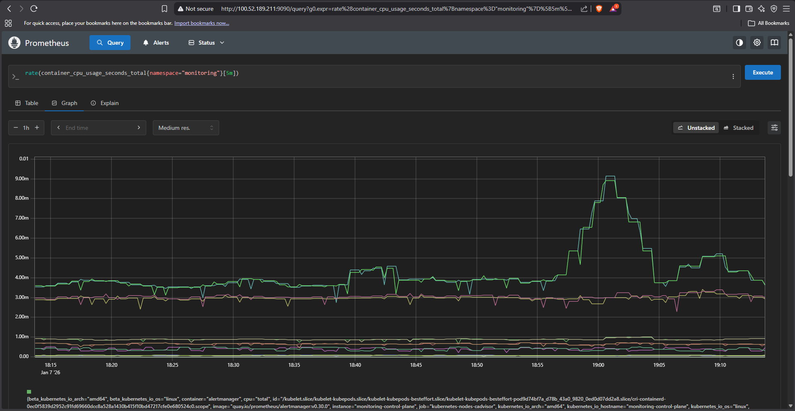

# Deploy Prometheus and Grafana on Kubernetes (kind on AWS EC2)

This project demonstrates how to deploy a **Kubernetes monitoring stack (Prometheus + Grafana)** on a **kind (Kubernetes in Docker) cluster running on an AWS EC2 instance**, using **Terraform and Helm**.

The goal is to showcase hands-on skills in:

* Kubernetes cluster setup (kind)
* Infrastructure as Code (Terraform)
* Helm-based application deployment
* Kubernetes monitoring and visualization

---

## Architecture

```
AWS EC2 (Ubuntu)
 ├── Docker
 ├── kind (Kubernetes cluster)
 ├── kubectl
 ├── Helm
 ├── Terraform
 └── Monitoring Stack
      ├── Prometheus
      └── Grafana
```



---

## Tools & Technologies

* **AWS EC2** – Compute environment
* **kind** – Lightweight Kubernetes cluster
* **Docker** – Container runtime
* **Terraform** – Infrastructure as Code
* **Helm** – Kubernetes package manager
* **Prometheus** – Metrics collection
* **Grafana** – Metrics visualization

---

## Repository Structure

```
.
├── providers.tf
├── monitoring-namespace.tf
├── prometheus.tf
├── grafana.tf
├── kind-config.yaml
├── README.md
└── screenshots/
    ├── pods.png
    ├── services.png
    ├── prometheus-ui.png
    ├── grafana-dashboard.png
    └── architecture.png
```

---

## Deployment Steps

### 1⃣ Create kind Cluster

```bash
kind create cluster --name monitoring --config kind-config.yaml
```

Verify:

```bash
kubectl get nodes
```

---

### 2 Initialize Terraform

```bash
terraform init
terraform validate
terraform apply
```

This will:

* Create the `monitoring` namespace
* Deploy Prometheus using Helm
* Deploy Grafana using Helm

---

### 3 Verify Kubernetes Resources

```bash
kubectl get pods -n monitoring
kubectl get svc -n monitoring
```

**Screenshot:**



---

## Accessing the Applications

### Prometheus

Service type: **NodePort**

```
http://<EC2_PUBLIC_IP>:30000
```

**Screenshot:**



---

### Grafana

Service type: **NodePort**

```
http://<EC2_PUBLIC_IP>:30001
```

**Default Credentials:**

* Username: `admin`
* Password:

```bash
kubectl get secret grafana -n monitoring \
-o jsonpath="{.data.admin-password}" | base64 --decode
```

**Screenshot:**


---

## Grafana Configuration

1. Log in to Grafana
2. Go to **Settings → Data Sources**
3. Add **Prometheus**
4. URL:

   ```
   http://prometheus-server.monitoring.svc.cluster.local
   ```
5. Save & Test
6. Import Kubernetes dashboards

---

## Screenshots Included

* Running Pods (`kubectl get pods -n monitoring`)
* Services (`kubectl get svc -n monitoring`)
* Prometheus UI
* Grafana Dashboard

---

## Why Terraform + Helm?

* Declarative and repeatable deployments
* Version-controlled infrastructure
* Simplified Helm chart management
* Easy upgrades and rollbacks
* Clear separation of infrastructure and application layers

---

## Security Note

For learning purposes, the EC2 security group allows **all inbound and outbound traffic**.

In production:

* Restrict ports
* Use Ingress + HTTPS
* Enable authentication
